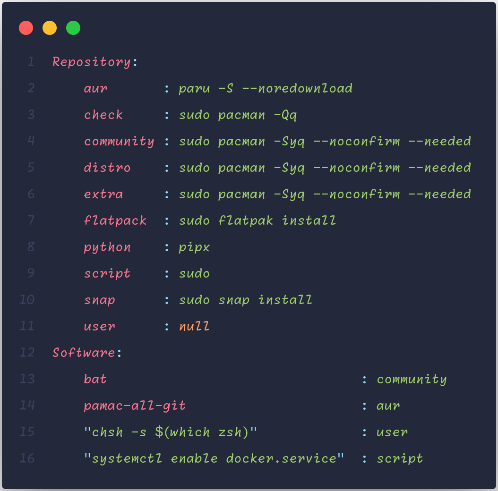
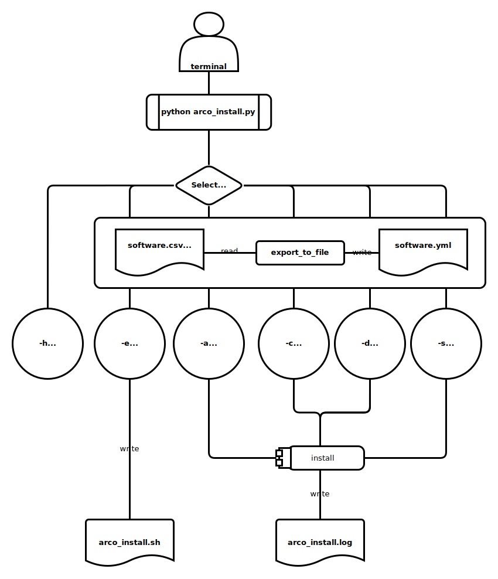

# Arco Install

[](http://opensource.org/licenses/MIT)
[](https://github.com/AlbertoVf/arco-install/tags)

Software installer to [Arcolinux](https://arcolinux.com/).

## Software Data

> [!IMPORTANT]
> Configure filepath on `arco_install/__init__.py`
> Rename `software.template.yml` to `software.yml` OR replace `software_input`

### Input file

The default software is a yaml file with `Repository` and `Software`

- `Repository`: repository name and command installation software
- `Software`:: list of software with `package_name`: `repository_name`



## Command line usage



- Run help command

    ```bash
    python arco_install.py -h
    ```

    ```log
    usage: arco_install.py [-h] [-a] [-c] [-d] [-s] [-e]

    Install the required packages

    options:
    -h, --help        show this help message and exit
    -a, --all         Install all software
    -c, --compilable  Install software from AUR, snap
    -d, --distro      Install software from distribution and communnity
    -s, --script      Install extra software
    -e, --export      Build bashscript installation file
    ```

- Install script command: Run scripts who is a command line, not a package

    ```bash
    python arco_install.py [-s | --script]
    ```

- Install all software included in the software file

    ```bash
    python arco_install.py [-a | --all]
    ```

- Install software included in repositories who necessary compilation: snap, aur, flatpack...

    ```bash
    python arco_install.py [-c | --compilable]
    ```

- Install software included in the distribution repositories: community, distribution, extra, large_support, 3rd_...

    ```bash
    python arco_install.py [-d | --distro]
    ```

- Build a `.sh` file to install any software manually ( 1 line = 1 command installation)

    ```bash
    python arco_install.py [-e | --export]
    ```
