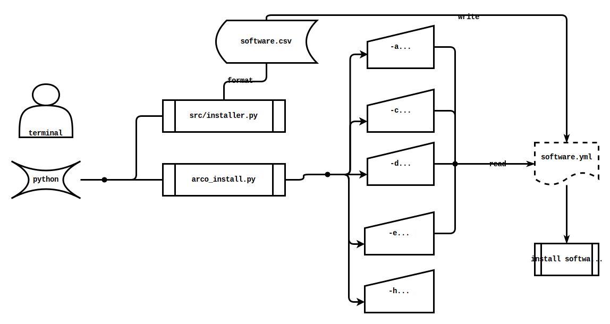

# Arco Install

[](http://opensource.org/licenses/MIT) [](https://github.com/AlbertoVf/arco-install/tags)

Instalador de software en [Arcolinux](https://arcolinux.com/).

Este repositorio contiene un script de instalación para ArcoLinux, una distribución de Linux basada en Arch Linux. Con este script, puedes instalar software en ArcoLinux fácilmente y personalizar tu instalación.

## Software

### Tipo de software

- `all`: todo tipo de software
- `minimal`: software básico
- `terminal`: software de comandos de terminal
- `programing`: software para programación
- `gammer`: software para juegos

### Tipo de repositorio

- `community`: software de la comunidad
- `distro`: software propio de la distribución
- `aur`: software de usuarios para [archlinux](https://aur.archlinux.org/)
- `snap`: software [snap](https://snapcraft.io/store)
- `extra`: software/configuraciones instalado a traves de comandos

```json
{
 "repositorio"    : "valor único(community|distro|aur|snap|extra);",
 "tipos"          : "0 o mas valores (all+minimal+terminal+programming+gammer)",
 "nombre paquete" : "nombre de software en el repositorio",
 "formato csv"    : "<repositorio>;<tipos>;<nombre paquete>;"
}
```

## Ejecución

```sh
 .
├──  arco-install.sh
├──  software
│  ├──  software.csv
│  └──  software.json
└──  src
   ├──  format-software.sh
   ├──  installer.sh
   └──  messages.sh
```

```sh
# Opcional: Crea un fichero json a partir del archivo csv
sh src/format-software.sh
```

```sh
# ejecuta el script de instalación
sudo sh arco-install.sh
```


