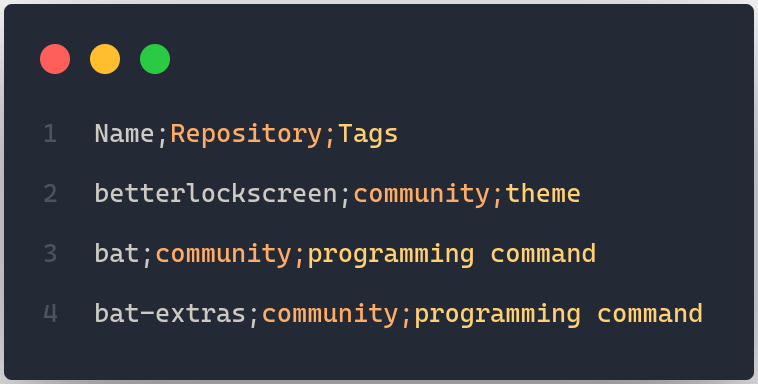
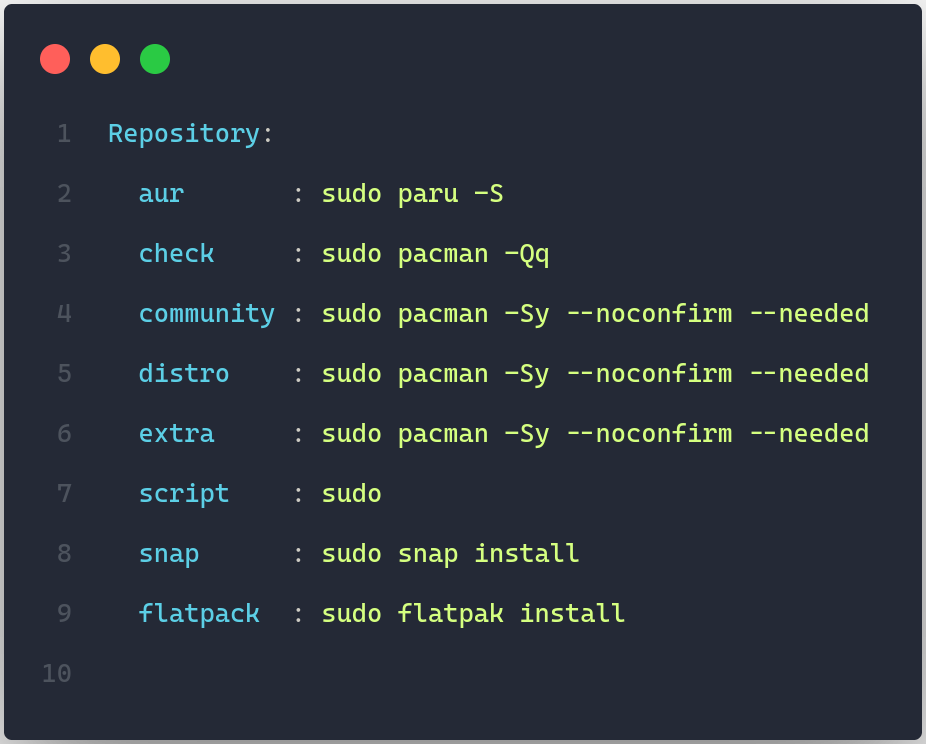
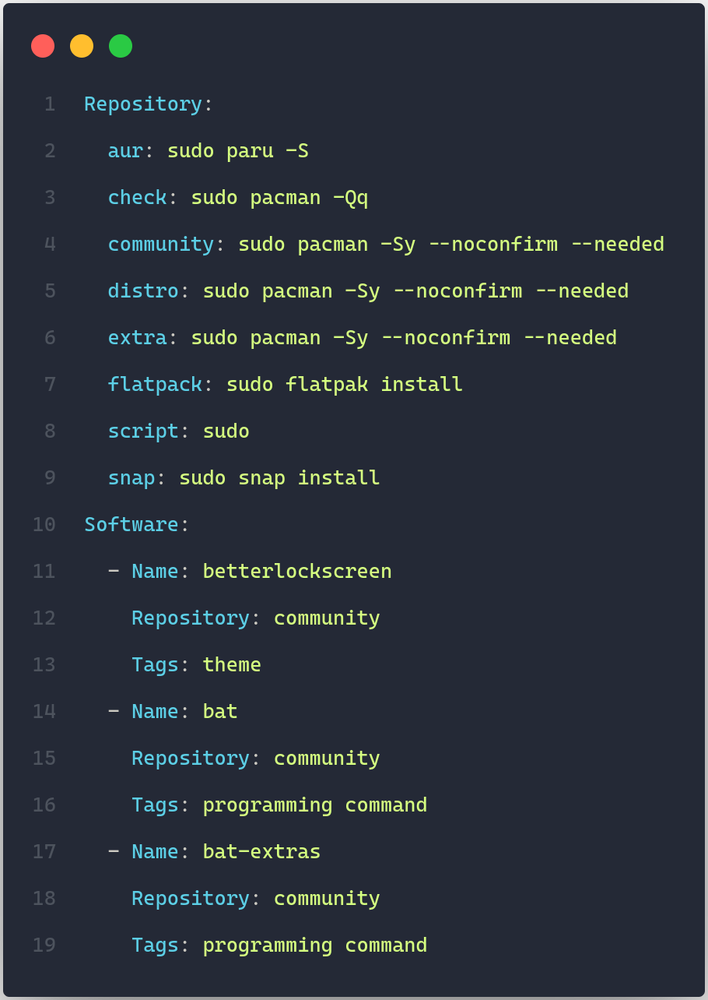
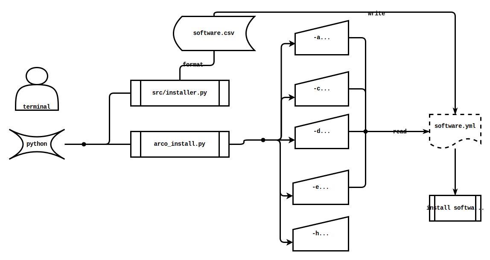

# Arco Install

[](http://opensource.org/licenses/MIT)
[](https://github.com/AlbertoVf/arco-install/tags)

Software installer to [Arcolinux](https://arcolinux.com/).

## Software

### Software import

#### CSV

The default software is a csv file with an header row `Name;Repository;Tags`, separated by `;`

- `Name`: Software name
- `Repository`: Software repository where it is included
- `Tags`: keyword, tag used to categorize the software



#### YAML

- `software.bak.yml` include repository object with repository_name and installation

```yaml
Repository:
  repository_name : repository_command_install
  ...:...
```

- `repository_name`: repository where the software is included
- `repository_command_install`: command to install the software


### Software export

Export the software list and the installation command to yaml/json file ( yaml by default)



## Command line usage



Run help command

```bash
python arco_install.py -h
```

```log
usage: arco_install.py [-h] [-a] [-c] [-d] [-s] [-e]

Install the required packages

options:
-h, --help        show this help message and exit
-a, --all         Install all software
-c, --compilable  Install software from AUR, snap
-d, --distro      Install software from distribution and communnity
-s, --script      Install extra software
-e, --export      Build bashscript installation file
```

Install script command: Run scripts who is a command line, not a package

```bash
python arco_install.py [-s | --script]
```

Install all software included in the software file

```bash
python arco_install.py [-a | --all]
```

Install software included in repositories who necessary compilation: snap, aur, flatpack...

```bash
python arco_install.py [-c | --compilable]
```

Install software included in the distribution repositories: community, distribution, extra, large_support, 3rd_...

```bash
python arco_install.py [-d | --distro]
```

Build a `.sh` file to install any software manually ( 1 line = 1 command installation)

```bash
python arco_install.py [-e | --export]
```
